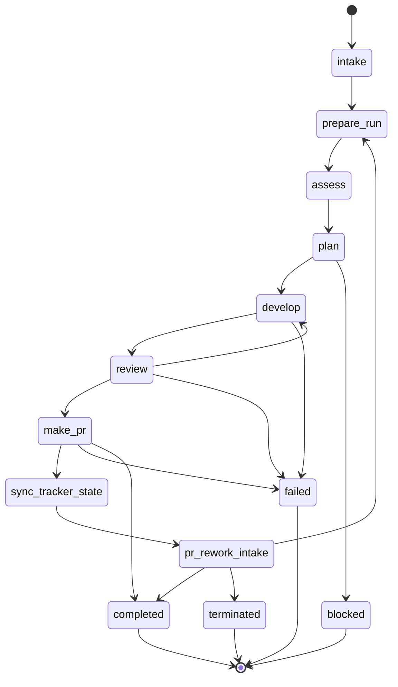

# Blast Furnace

Blast Furnace is an agent orchestrator server that polls one configured GitHub repository for labeled issues and drives them through a pipeline until a pull request is created, updated after review feedback, or the run reaches a terminal failure state.

The main practical feature is that agent work is executed through Codex CLI. This lets the pipeline use a subscription-based agent interface instead of paying per orchestration token in the server itself, while keeping deterministic orchestration, state, and handoff contracts around the agent steps.

## Overview

Blast Furnace runs continuously. It polls the repository configured by `GITHUB_OWNER` and `GITHUB_REPO`, finds open issues with the `ready` label, prepares a branch and isolated workspace, asks Codex to plan and develop the change, runs a deterministic Quality Gate, asks Codex for review, then commits, pushes, and opens a PR.

The runtime is intentionally single-target-repository. It does not choose between multiple production repositories at runtime.

GitHub workflow state is label-based rather than issue-status-based:

- intake selects open issues with label `ready`;
- tracker sync removes `ready` and adds `in review`;
- PR rework is triggered by label `rework` on the PR.

This is more portable than coupling the orchestrator directly to GitHub Project columns. The target repository should have its own GitHub Project automation that maps labels to the desired columns and statuses. Blast Furnace owns the labels; GitHub automation owns column movement.

## Prerequisites

- Node.js >= 20.0.0
- Redis server for BullMQ
- Git
- Docker Compose, if using the bundled Redis startup scripts
- GitHub token with enough access to read issues, write issue/PR labels and comments, create branches, push commits, read PR state, and create PRs
- A prepared target GitHub repository with the labels and project automation described below

## Target Repository Setup

Blast Furnace is designed to operate against one target GitHub repository per running server instance.

Prepare the target repository before starting the orchestrator:

1. Create labels `ready`, `in review`, and `rework`.
2. Add GitHub Project automation, if the project board matters, so `ready` and `in review` move issues to the target columns.
3. Ensure the default base branch used by the current implementation is `main`.
4. Add tests or another deterministic verification command suitable for `QUALITY_GATE_TEST_COMMAND`.
5. Create an issue, write a clear task description, and add the `ready` label when it should be picked up.

The current implementation uses only these labels. More project columns can exist because the orchestrator does not depend on their names.

## Quick Start

1. Install dependencies:

   ```bash
   npm install
   ```

2. Configure environment variables:

   ```bash
   cp .env.local.example .env.local
   source ./scripts/load-env.sh
   ```

3. Start Redis and the development server:

   ```bash
   ./scripts/start.sh
   ```

   The start script loads `.env.local` when present, starts Redis with Docker Compose, waits for Redis to become healthy, then runs `npm run dev`.

   To start Redis manually instead:

   ```bash
   docker-compose up -d
   npm run dev
   ```

4. In the configured target repository, create or update an open issue and add label `ready`.

5. Watch the issue comment created by Blast Furnace. It is updated as the run moves through the pipeline.

6. Inspect run files under `.orchestrator/runs/...` after or during the run.

## Configuration

All application configuration is loaded from environment variables. For local development, keep values in `.env.local` using shell `export` syntax and load them with `source ./scripts/load-env.sh`.

### Required Variables

| Variable | Description |
|----------|-------------|
| `GITHUB_TOKEN` | GitHub personal access token used for issue, branch, PR, label, comment, clone, and push operations |
| `GITHUB_OWNER` | Single target repository owner, user, or organization |
| `GITHUB_REPO` | Single target repository name |

### Optional Variables

| Variable | Default | Description |
|----------|---------|-------------|
| `NODE_ENV` | `development` | Runtime environment |
| `PORT` | `3000` | HTTP server port |
| `REDIS_HOST` | `localhost` | Redis host |
| `REDIS_PORT` | `6379` | Redis port |
| `REDIS_PASSWORD` | (none) | Redis password |
| `CORS_ORIGIN` | `true` | CORS allowed origins, comma-separated list or `*` for all |
| `GITHUB_POLL_INTERVAL_MS` | `60000` | Intake and PR-rework polling interval in milliseconds, minimum `1000` |
| `CODEX_CLI_PATH` | `npx @openai/codex` | Command used to launch Codex CLI |
| `CODEX_MODEL` | `gpt-5.4` | Model passed to Codex CLI with `--model` when the CLI path does not already specify a model |
| `CODEX_TIMEOUT_MS` | `600000` | Codex CLI timeout in milliseconds, capped at 10 minutes |
| `QUALITY_GATE_TEST_COMMAND` | (none) | Deterministic target-repository test command run by the Develop Stop hook |
| `QUALITY_GATE_TEST_TIMEOUT_MS` | `180000` | Quality Gate command timeout in milliseconds, minimum `1` |
| `REVIEW_ATTEMPT_LIMIT` | `3` | Maximum agent review/develop rework attempts before the run stops |
| `MAX_HUMAN_REWORK_ATTEMPTS` | `3` | Maximum human-triggered PR rework attempts |
| `ORCHESTRATION_STORAGE_ROOT` | current process working directory | Root where `.orchestrator/runs/...` run files are written |

## Architecture

### Operating Model

The orchestrator is queue-driven. BullMQ carries transport payloads, retries jobs, and schedules stage transitions. Durable handoff after `prepare-run` is stored in run-scoped JSONL files under the Blast Furnace repository, not in the cloned target repository workspace.

Current main flow:

```text
GitHub polling intake
  -> prepare-run
  -> assess
  -> plan
  -> develop
  -> review
  -> make-pr
  -> sync-tracker-state
  -> pr-rework-intake
```

`pr-rework-intake` keeps polling the created PR. It terminates the run when the PR is merged or closed, or starts a new rework pass when label `rework` appears on the PR.

### Pipeline

| Stage | What happens | Deterministic? |
|-------|--------------|----------------|
| `intake` | Polls the configured repository for open issues labeled `ready`, skips issues that already have an active run, creates a run, writes initial status, and enqueues `prepare-run`. | Yes |
| `prepare-run` | Creates or reuses branch `issue-{number}-{slugified-title}`, clones the target repo into `/tmp`, checks out and resets the branch, records stable context, and appends the first handoff. In rework mode it checks out the existing PR branch at the expected SHA. | Yes |
| `assess` | Assessment stage reserved for deciding whether the issue is clear enough and whether work can be derived safely. Current implementation is stub-safe: it records a successful stub assessment and does not yet block unclear tasks. | Currently deterministic stub |
| `plan` | Runs Codex with `prompts/plan.md`, validates the returned plan against `config/plan-checks.yaml`, retries up to 3 times when required sections are missing, and blocks if validation is exhausted. | Agent output plus deterministic validation |
| `develop` | Runs Codex in the prepared workspace with the accepted plan or rework feedback. Codex hooks are enabled. | Agent output |
| Quality Gate inside `develop` | Runs `QUALITY_GATE_TEST_COMMAND` from the target workspace through the Codex Stop hook. Failing or timed-out checks block Codex from stopping for bounded attempts so it can fix errors in the same session. Final failed, timed-out, or misconfigured outcomes stop the run before review. | Yes |
| `review` | Runs Codex in read-only review mode. It must return exactly `Review Success` or `Review failed` with actionable findings. Failed review loops back to `develop`; malformed or exhausted review stops the run. | Agent output plus deterministic parser |
| `make-pr` | Detects target-repo changes, excludes orchestrator and Codex hook files, commits, pushes, and creates a PR. No-change initial runs finish without PR. Duplicate or failed PR creation is terminal. | Yes |
| `sync-tracker-state` | Moves the source issue from `ready` to `in review`, removes PR label `rework` during rework finalization, updates the issue status comment, cleans the workspace, and enqueues PR polling. | Yes, with GitHub side effects |
| `pr-rework-intake` | Polls PR state. If merged, completes the run. If closed without merge, terminates it. If label `rework` appears, collects human PR comments, routes rework to `plan` or `develop`, and restarts through `prepare-run`. If idle, delays itself and polls again. | Mostly deterministic; route analysis uses Codex and defaults to `plan` on failure |



### State, Handoff, and Tracing

Each run gets a timestamped file set:

```text
<ORCHESTRATION_STORAGE_ROOT>/.orchestrator/runs/<YYYY-MM-DD_HH.MM_runId>/
  <YYYY-MM-DD_HH.MM_runId>_run.json
  <YYYY-MM-DD_HH.MM_runId>_handoff.jsonl
```

`run.json` is mutable run state stored next to the JSONL ledger. It contains the current stage, run status, stage summaries, counters, stable context, the latest handoff pointer, pending next-stage recovery data, and tracker-comment metadata.

`*_handoff.jsonl` is append-only. Each line is one JSON handoff record with `recordId`, `sequence`, `runId`, `fromStage`, `toStage`, `stageAttempt`, `reworkAttempt`, `dependsOn`, `status`, and `output`.

Handoff happens by appending one JSON object to the JSONL file. Each next stage receives only a transport pointer to the previous record, reads that record, validates the payload and record model deterministically, and stops if the handoff is malformed or does not match the receiving stage. This keeps business data out of BullMQ payloads.

The JSONL handoff ledger is also the run-level trace file. It is convenient to inspect after a run, and it can drive a future UI by replaying appended records and reading `run.json`. Runtime process logs are structured JSON written to stdout; the durable per-run sequence is the JSONL handoff ledger.

Quality Gate stdout/stderr is written under `.orchestrator/runs/.../quality/attempt-N.log` while diagnostics are needed. Successful quality artifacts are removed after the Develop handoff is written; failed, timed-out, and misconfigured runs keep them.

### GitHub Issue Status Comment

Blast Furnace creates or updates one marker-based GitHub issue comment for the run. The marker lets the server recover and update the same comment instead of creating a new one.

The comment is updated at the main visible transitions:

- intake creates the initial "starting work" status;
- `prepare-run`, `assess`, `plan`, `develop`, Quality Gate, `review`, `make-pr`, and `sync-tracker-state` mark pending, in-progress, completed, skipped, retrying, blocked, or failed rows;
- Quality Gate failures, plan validation exhaustion, review exhaustion, PR creation failures, no-change outcomes, and tracker sync warnings are surfaced in the comment;
- human PR rework adds a scoped rework section and tracks that pass separately.

This lets a user follow pipeline progress from the GitHub issue without reading logs.

### Quality Gate in Develop

The deterministic Quality Gate is embedded into `develop` through a Codex Stop hook. This is deliberate: if tests fail, Codex receives bounded feedback while the same session still has the implementation context. The agent can fix failures before the pipeline hands off to review, which is more effective than starting a fresh stage with less context.

`QUALITY_GATE_TEST_COMMAND` must be deterministic, non-interactive, and run from the cloned target repository workspace.

### Ambiguous Tasks

The pipeline has an `assess` stage for evaluating task clarity and safety before planning. That is the intended place to stop, ask for clarification, or mark the task blocked when the issue is underdescribed or when the required action cannot be derived from code.

That behavior is not fully implemented yet. Today `assess` is a stub that records "Assessment deferred for this iteration." The later `plan` stage can still block if Codex does not return a structurally valid plan, but it does not yet ask a human clarifying questions for unclear requirements.

### Post-PR Rework

After PR creation and tracker sync, `pr-rework-intake` polls the PR:

- merged PR -> terminal completed run;
- closed unmerged PR -> terminal terminated run;
- no `rework` label -> delayed poll again;
- `rework` label -> collect human PR comments and review comments, filter bot/outdated/resolved/deleted comments, analyze whether to restart at `plan` or `develop`, prepare a fresh workspace, and push further commits to the same PR branch.

Human review feedback is intentionally label-triggered. The system does not yet react to every PR event, GitHub review state, CI status, or comment in real time.

## How to Reproduce a Run

1. Create a test GitHub repository or choose a safe target repository.
2. Add labels `ready`, `in review`, and `rework`.
3. Configure GitHub Project automation so labels map to the desired columns, if using a project board.
4. Create a token with repository access and put it in `.env.local`.
5. Set `GITHUB_OWNER`, `GITHUB_REPO`, `QUALITY_GATE_TEST_COMMAND`, and optionally `CODEX_CLI_PATH`.
6. Run `npm install`.
7. Run `source ./scripts/load-env.sh`.
8. Run `./scripts/start.sh`, or run `docker-compose up -d` and `npm run dev`.
9. Create an open issue in the target repository and add label `ready`.
10. Watch the GitHub issue status comment, the PR, and `.orchestrator/runs/...`.
11. To test human rework, leave a human PR comment and add label `rework` to the PR.

See `docs/test-repository-setup.md` for an additional local testing checklist.

## Technical Stack

- Agents: Codex CLI for planning, development, review, and PR rework route analysis
- LLM: configured by `CODEX_MODEL`, default `gpt-5.4`
- Tracker integration: GitHub Issues, GitHub Pull Requests, GitHub labels, GitHub issue comments through Octokit REST
- Language: TypeScript, ESNext modules
- HTTP framework: Fastify v5
- Background jobs: BullMQ v5 with Redis
- Runtime: Node.js >= 20
- Git workspaces: cloned temporary directories under `/tmp`
- Testing: Vitest
- Linting: ESLint with typescript-eslint
