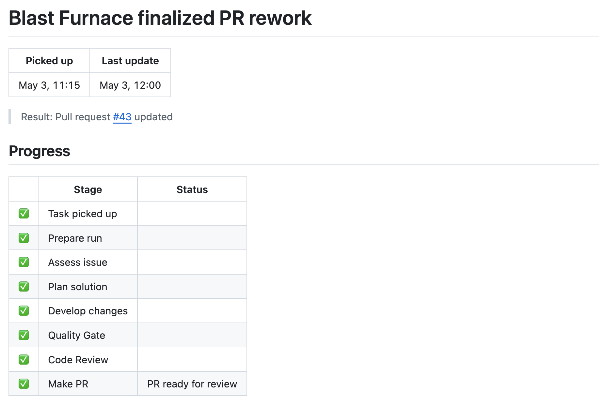
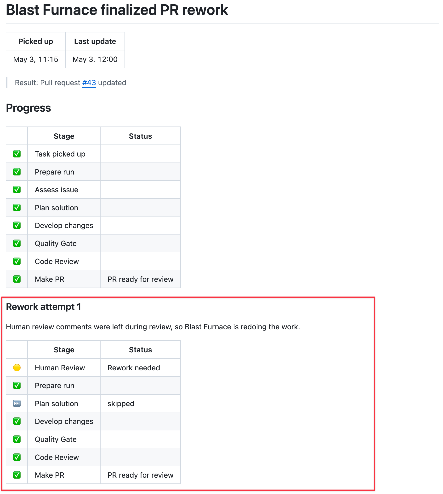

# Created PR and Rework

## PR Summary

- PR title: `Process issue #42: [Feature] Capitalize the first letter of Category name`
- PR number: private PR #43

## What Changed

The change normalized category names at submission time so that a submitted category like `scientific books` is saved and displayed as `Scientific books`.

The implementation plan targeted:

- the category creation path
- the category rename path
- a shared helper for trimming and uppercasing only the first character
- focused unit and category-flow test coverage

## Why It Was Needed

The original issue described inconsistent category names when users entered names with different capitalization. The requested behavior was to standardize category names when the user submitted the value.

## Quality Checks

Initial implementation:

- Command: `npm ci --cache [REDACTED] && npm run test -- --watchman=false`
- Result: passed
- Test suites: 23 passed
- Tests: 104 passed

Rework implementation:

- Command: `npm ci --cache [REDACTED] && npm run test -- --watchman=false`
- Result: passed
- Test suites: 23 passed
- Tests: 107 passed

## Review Result

The automated review stage passed before PR creation and passed again after rework.

## Human Feedback / Rework Trigger

A human reviewer requested rework after the first PR update:

> Please rework this issue. Double first letter in title

The PR rework intake stage classified this as a Develop-level change because the feedback requested a localized behavior adjustment: duplicate the first letter in the title. It did not require a new plan.

## Rework Outcome

Blast Furnace routed the PR back through Prepare Run, Develop, Quality Gate, Review, Make PR, and Tracker Sync. The same private PR was updated, Quality Gate passed again, and the final tracker status recorded the pull request as updated.

## Screenshot Placeholders

