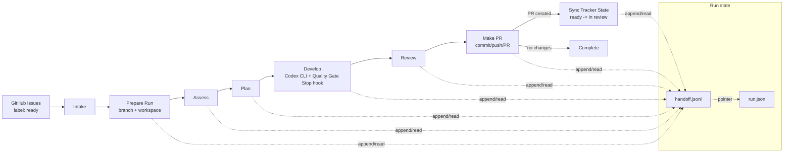

# Промежуточный отчет по оркестратору

По оркестратору у нас получается сервис, который забирает задачи из GitHub Issues и прогоняет их через пайплайн: `Intake -> Prepare Run -> Assess -> Plan -> Develop -> Review -> Make PR -> Sync Tracker State`. Quality Gate теперь выполняется внутри `Develop` через Codex Stop hook, чтобы при падении тестов Codex получил короткий feedback и мог исправить проблему в той же сессии. Оркестратор исполняет агентские этапы через Codex CLI, то есть можно пользоваться подпиской и не платить за токены. Все, что можно сделать детерминированно, делается детерминированно. Архитектурно BullMQ/Redis отвечают за транспорт и retry-механизм, состояние прогона хранится в файле `run.json`, а все хэндофы проходят через JSONL-файл со сквозной нумерацией входящих в него JSON-записей. Он же служит логом, и к нему же можно подключить TUI или любой другой интерактивный интерфейс.

Стек: TypeScript, Node.js, BullMQ + Redis, Codex CLI, Docker Compose для локального Redis.

Сделано: TypeScript/Fastify сервер, polling GitHub Issues с лейблом `ready`, BullMQ worker routing, подготовка branch/workspace, запуск Codex CLI через `node-pty`, Quality Gate Stop hook внутри `Develop`, handoff через JSONL между стадиями, commit/push/создание PR, перевод GitHub issue из `ready` в `in review`, cleanup workspace. Сейчас этапы `Assess`, `Plan` и `Review` есть, но являются заглушками - их нужно доделать. Дальше можно пойти по фичам, если успеем:
- Быстрая проверка, достаточно ли специфицирована задача, и отказ, если нет, до запуска основного пайплайна
- Сбор негативной памяти о причинах переделок и использование ее на этапе планирования, чтобы не повторять таких же ошибок + регулярный запуск self-improvement loop для улучшения кода самого агента
- LLM Substitution: если две попытки rework с одной моделью не дали результата, следующая попытка запускается на другой LLM
- Уже реализована фича запуска на подписках, а не через API

Основные сложности - организационные. Было непросто синхронизироваться по времени и задачам, нас стало на одного человека меньше. Затем мы столкнулись с тем, что бутстрап требует изменений почти во всем коде, поэтому на время бутстрапа работаем по очереди. Еще у нас разношерстный стек, так что выбрали писать оркестратор на TS, который никто из нас не знает, но на котором написано множество подобных систем. Это первый опыт, когда к коду приходится относиться как к disposable. Из наблюдений: особенно большую роль играют тестирование и хорошая документация.

## Архитектурная схема

